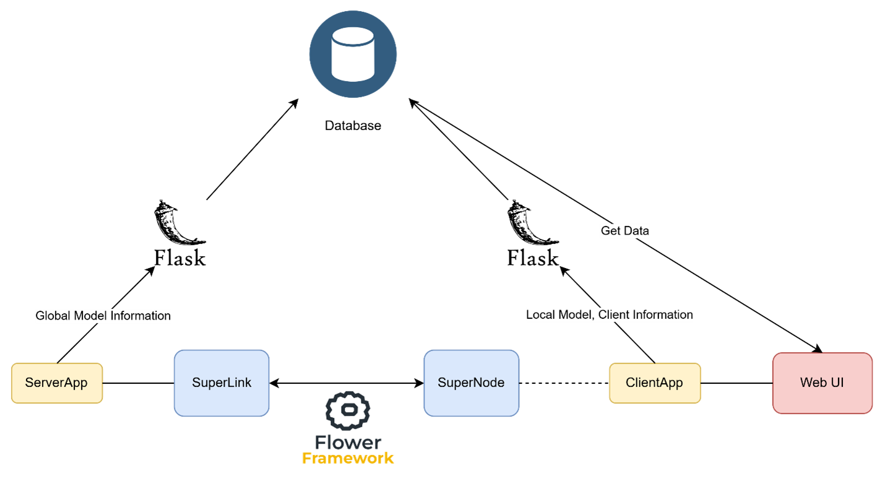
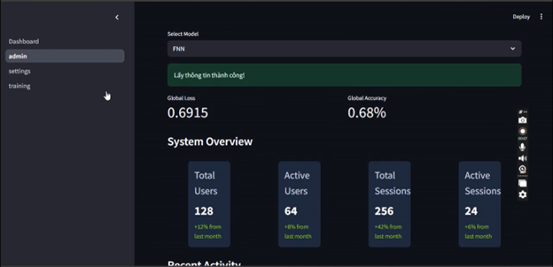
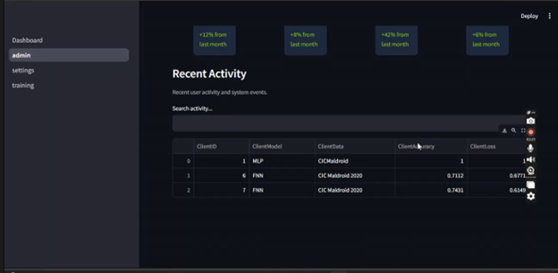
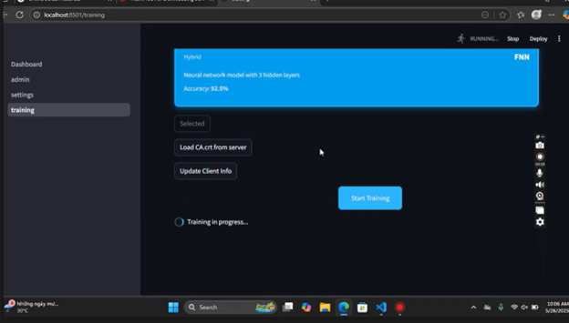

# UIT Federated
 Đây là 1 ứng dụng web nhằm giám sát quá trình thực hiện học liên kết giữa client và server, các tính năng bao gồm cho phép phía client train model trên 1 dữ liệu có sẵn, các tham số sau đó sẽ được tổng hợp ở phía 
 server và trình bày trên dashboard ở giao diện ứng dụng web. Thực nghiệm được nhóm tiến hành trên 2 máy sử dụng chung 1 mạng, 1 máy đóng vai trò là client và 1 máy đóng vai trò server.
## 📖 Cách sử dụng 
### 1. Cài đặt package
```bash
   pip install -r requirements.txt
   ```
### 2. Khởi động streamlit và flask
```bash
   streamlit run Dashboard.py
   ```
```bash
   flask --app server.py run
   ```
## 🖼️ Một số hình ảnh
### 🔹 Kiến trúc
<p align="center">
  
</p>

---

### 🔹 Trang Admin
<p align="center">
  
</p>

---

### 🔹 Trang Dashboard
<p align="center">
  
</p>

---

### 🔹 Trang Training
<p align="center">
  
</p>

